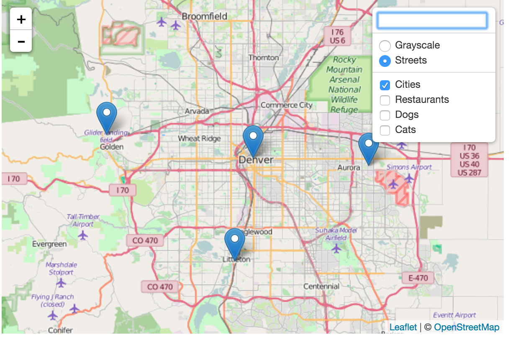
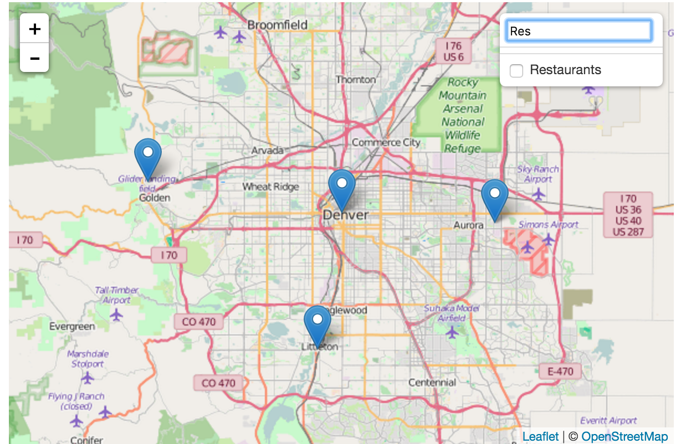

Leaflet.filterablelayercontrol
===========================

Leaflet layer control with filterable layer list. When layers list is really long, this plugin is really helpful to quickly filter them.




## Installation

Include the compressed JavaScript and CSS files located in the `/dist` folder.

This project is also available via bower and jspm:

```
bower install leaflet-filterable-layer-control
```

## Usage

### Initialization

Add groupings to your overlay layers object, and swap out the default layer
control with the new one.

```javascript
var groupedOverlays = {
  "Landmarks": {
    "Motorways": motorways,
    "Cities": cities
  },
  "Points of Interest": {
    "Restaurants": restaurants
  }
};

L.control.groupedLayers(baseLayers, groupedOverlays).addTo(map);
```
